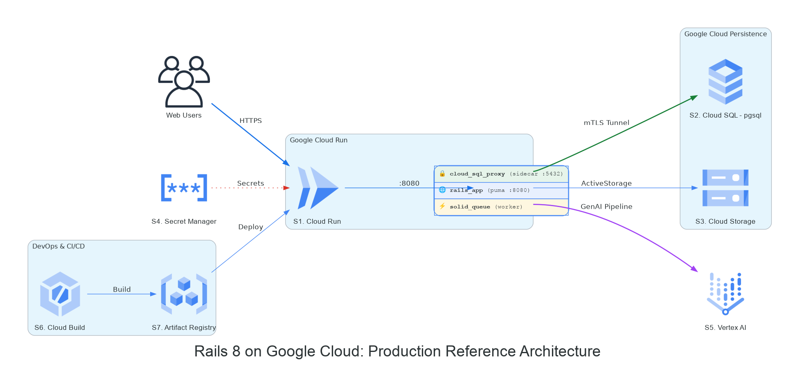

# rails8-app-on-gcp

A golden Rails App optimized for GCP (ActiveStorage on GCS, docker-compose on Cloud Run, ...)



### 🔗 Live Environments

| Env | URL |
| :--- | :--- |
| 🟢 **Dev** | [palladius-genai-rails-app-**dev**-….run.app](https://palladius-genai-rails-app-dev-272932496670.europe-west1.run.app/) |
| 🔴 **Prod** | [palladius-genai-rails-app-**prod**-….run.app](https://palladius-genai-rails-app-prod-272932496670.europe-west1.run.app/) |

### 📚 Workshop & Docs

| Resource | URL |
| :--- | :--- |
| 🌐 Workshop Portal | [palladius.github.io/rails8-app-on-gcp/](https://palladius.github.io/rails8-app-on-gcp/) |
| 🚀 Presentation Slides | [palladius.github.io/…/slides/](https://palladius.github.io/rails8-app-on-gcp/slides/) |
| 📖 Workshop Codelab | [palladius.github.io/…/codelab/](https://palladius.github.io/rails8-app-on-gcp/codelab/) |
| 🐝 Workshop Hive (Leaderboard) | [workshop-hive-….run.app](https://workshop-hive-x42ijqglgq-ew.a.run.app/) |

> 🎶 **Official Workshop Anthem** (Google Lyria 3 Pro): 🎧 [Listen / Download MP3 (3.4 MB)](https://raw.githubusercontent.com/palladius/rails8-app-on-gcp/artifacts/issue-44/assets/lyria-3-pro-preview.mp3)

## ✅ Prerequisites

Every command below is a [`just`](https://just.systems) recipe, so **install `just` first** — without it nothing in this repo runs:

```bash
# Recommended: latest upstream release (1.40+)
curl --proto '=https' --tlsv1.2 -sSf https://just.systems/install.sh | bash -s -- --to ~/.local/bin

# macOS
brew install just

# Debian/Ubuntu — ships 1.21; supported, but older than upstream
sudo apt install just
```

Check it works with `just --list`: it should print the full recipe list — if it prints a parse error instead, your `just` is too old for the justfile (see `just test-justfile`). Then make sure you also have:

| Tool | Check | Needed for |
| :--- | :--- | :--- |
| [**just**](https://just.systems) (1.21+, 1.40+ recommended) | `just --version` | every command in this repo and in the workshop |
| [**Git**](https://git-scm.com/downloads) (2.30+) | `git --version` | cloning the repo, branching, version control |
| [**Ruby 3.3+**](https://www.ruby-lang.org/en/downloads/) & [**Rails 8**](https://rubyonrails.org/) | `ruby -v`, `rails -v` | `just install`, `just dev` |
| [**Docker**](https://docs.docker.com/get-docker/) & [**Docker Compose**](https://docs.docker.com/compose/install/) | `docker compose version` | `just compose-up` |
| [**Google Cloud SDK**](https://cloud.google.com/sdk/docs/install) (`gcloud` CLI) | `gcloud version` | deployment, `just workshop-test` |
| [**Terraform**](https://developer.hashicorp.com/terraform/install) (1.5+) | `terraform -version` | `just terraform-apply` |
| [**Node.js**](https://nodejs.org/) | `node -v` | `just slides`, `just screenshots` |
| [**Google Antigravity**](https://antigravity.google/download) | — | AI pair-programming assistant (IDE or CLI) |

> 💡 **Doing the workshop?** The full pre-flight checklist (Gmail identity, GCP billing, ADC, keys) is in [**Step 0 of the Codelab**](https://palladius.github.io/rails8-app-on-gcp/codelab/#step-0). Run `just workshop-test` to verify everything in one shot.

---

## 🚀 Quickstart: Starting the Apps & Services

You can run the project in three different local modes depending on your development focus:

### 1️⃣ Mode 1: Native Rails App (`just dev`)
Fastest feedback loop for application development using SQLite and Tailwind watcher.
```bash
# Install dependencies & prepare DB
just install

# Start local Rails development server (Puma on port 3000)
just dev
# (or: cd blog && bin/dev -p 3000)
```

### 2️⃣ Mode 2: Local Docker Compose Stack (`just compose-up`)
Full cloud-parity environment running PostgreSQL, background worker, Mailpit email catcher, and Adminer DB admin.
```bash
# Start all containers in detached mode
just compose-up
# (or: cd blog && docker compose up -d)

# Follow container logs
just compose-logs

# Stop containers
just compose-down
```

### 3️⃣ Mode 3: Local Workshop & Slides Servers
Interactive workshop portal, Codelab visualizer, and Marp presentation slides.
```bash
# Start the workshop server on port 8080 (serves portal at /, codelab at /codelab/)
just workshop-dev
# (or: ruby workshop/visualizer/server.rb --port 8080)

# Start Marp presentation slides server on port 8082
just slides
# (or: marp --server slides --html)

# Local document URLs:
# • Workshop Portal:    http://localhost:8080/
# • Presentation Slides: http://localhost:8080/slides/ (or http://localhost:8082/)
# • Workshop Codelab:   http://localhost:8080/codelab/
```

---

## 🧭 Localhost Services & Port Matrix

> 💡 **Fail-Fast Safety (Anti-POLA)**: Both **Native Dev** and **Docker Compose** intentionally target **Port 3000**. They are mutually exclusive, protecting you from ghost servers and ensuring [http://localhost:3000](http://localhost:3000) is *always* your Rails blog. Look at the **`RAILS8_ENV_LAUNCH_MODE`** telemetry badge in the footer to instantly see which runtime is responding!

| Mode / Environment | How to Start | Localhost Port(s) & URLs | Included Services |
| :--- | :--- | :--- | :--- |
| 🚀 **1. Native Rails App** | `just dev` | • [http://localhost:3000](http://localhost:3000) | Rails 8 Puma Server + Tailwind CSS Watcher (SQLite) |
| 🐳 **2. Docker Compose** | `just compose-up` | • [http://localhost:3000](http://localhost:3000)<br>• [http://localhost:8025](http://localhost:8025)<br>• [http://localhost:8081](http://localhost:8081)<br>• `localhost:5432` | • Rails 8 Web Server (`:3000`)<br>• Mailpit Email UI (`:8025`, SMTP `:1025`)<br>• Adminer DB GUI (`:8081`)<br>• PostgreSQL 16 DB (`:5432`)<br>• Solid Queue Worker (Background) |
| 📖 **3. Workshop & Slides** | `just workshop-dev`<br>`just slides` | • [http://localhost:8080](http://localhost:8080)<br>• [http://localhost:8080/slides/](http://localhost:8080/slides/)<br>• [http://localhost:8080/codelab/](http://localhost:8080/codelab/) | • Workshop Portal (`/`)<br>• Presentation Slides (`/slides/`)<br>• Interactive Codelab (`/codelab/`) |

## ☁️ Cloud Telemetry & Verification (`just cloud-run-status`)

To inspect your live Google Cloud deployment with instant architecture and environmental telemetry (Issue [#45](https://github.com/palladius/rails8-app-on-gcp/issues/45)):

```bash
# Automatically infer Cloud Run endpoint via Terraform or gcloud and fetch status
just cloud-run-status

# Or pass a custom URL:
just cloud-run-status https://my-service-xxx.europe-west1.run.app
```

See [`docs/WORKSHOP_TELEMETRY_AND_ALERTS.md`](docs/WORKSHOP_TELEMETRY_AND_ALERTS.md) for full telemetry specifications.

## 📖 Workshop

The workshop and presentation materials are published on GitHub Pages:

* 🌐 **Workshop Portal:** [https://palladius.github.io/rails8-app-on-gcp/](https://palladius.github.io/rails8-app-on-gcp/) (Landing entrypoint with bilingual switcher)
* 🚀 **Presentation Slides:** [https://palladius.github.io/rails8-app-on-gcp/slides/](https://palladius.github.io/rails8-app-on-gcp/slides/) (Kickoff, Antigravity setup, GCP credits)
* 🛠️ **Workshop Codelab:** [https://palladius.github.io/rails8-app-on-gcp/codelab/](https://palladius.github.io/rails8-app-on-gcp/codelab/) (Interactive step-by-step guide)

> 💡 *Want to know more about how this workshop was conceived, architected, and tested? Delve into the [Developer's Guide](docs/DEVELOPERS_GUIDE.md).*


