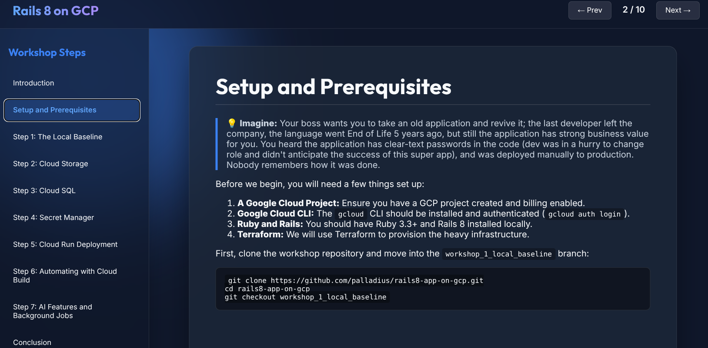
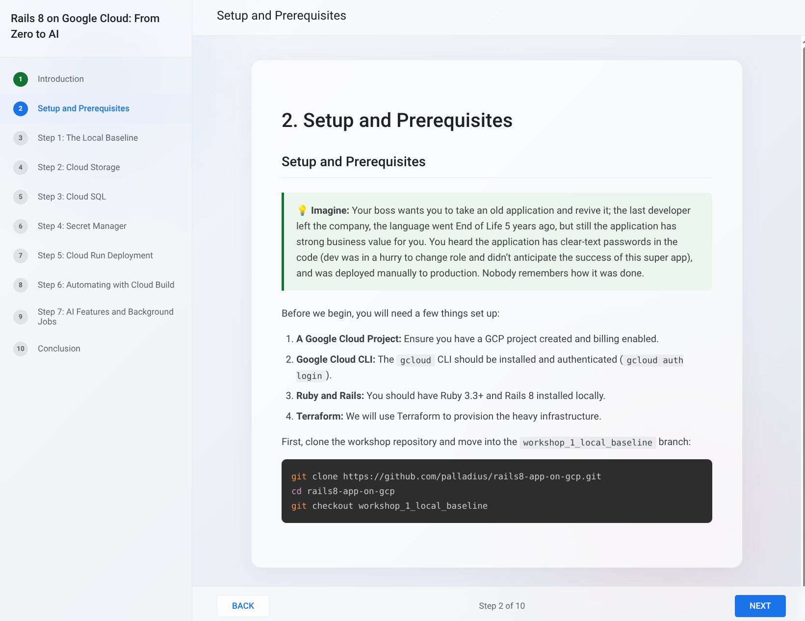

# rails8-app-on-gcp

A golden Rails App optimized for GCP (ActiveStorage on GCS, docker-compose on Cloud Run, ...)

🟢 **Dev**: https://palladius-genai-rails-app-dev-272932496670.europe-west1.run.app/
🔴 **Prod**: https://palladius-genai-rails-app-prod-272932496670.europe-west1.run.app/

## Development

We use `just` to orchestrate common tasks. To get started easily:

```bash
# Installs dependencies and prepares the database
just install

# Boots up the local development server
just dev
```

If you don't have `just` installed, you can simply change into the `blog/` directory and use standard Rails commands:

```bash
cd blog/
bundle install
bin/rails db:prepare
bin/dev -p 9090
```

## Workshop

The workshop is nicely active on GitHUb Pages:

* https://palladius.github.io/rails8-app-on-gcp/ (dark Astro look and feel)
* https://palladius.github.io/rails8-app-on-gcp/static/ (light Google Codelab look n' feel)



