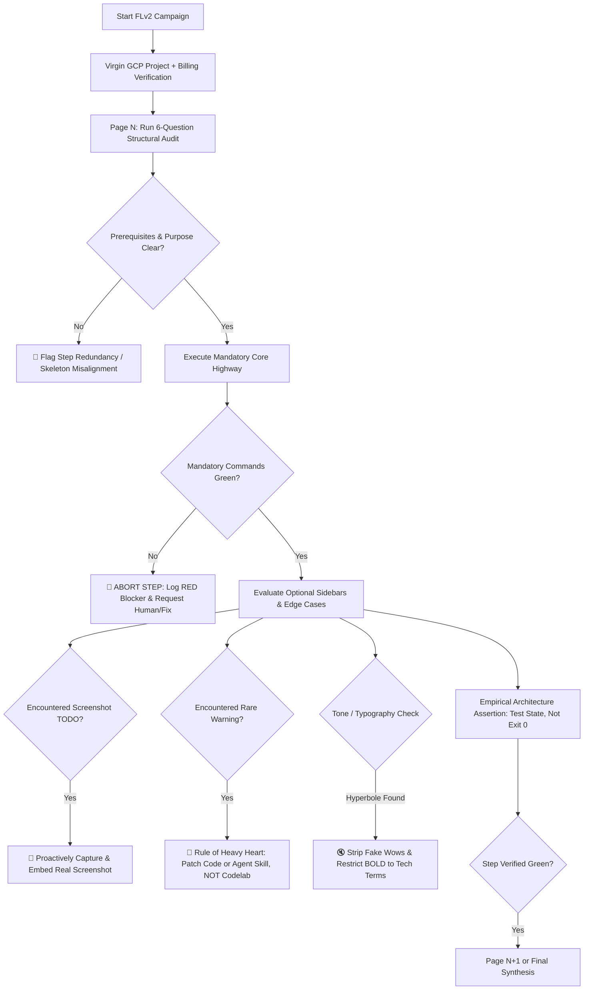

# 🦖 FL100 Retrospective: The 8 Sins of Automated Friction Logs & The Genesis of FL v2.0

> **Context:** Post-Mortem & Architectural Lessons Learned from Friction Log FL100 (September 2026).  
> **Authors:** Riccardo Carlesso (Supreme Leader & Advocate 🦖) & Antigravity (AI Pair Programmer 🤖)  
> **Tracking:** [GitHub Issue #152](https://github.com/palladius/rails8-app-on-gcp/issues/152) | [Google3 b/565350155](https://b.corp.google.com/issues/565350155)

---

## 🎯 The Epiphany
> *"Today I found out my 7 automated friction logs were close to garbage. Let's learn from it, iterate, and make a better FL methodology!"* — Riccardo

Between August and September 2026, 7 automated friction logs (`FL001` through `FL007`) were executed by autonomous AI agents against the Rails 8 on Google Cloud workshop. Every single one returned glowing green scorecards, celebrated bug fixes, and declared victory.

Yet, when Riccardo sat down to actually run the workshop from start to finish as a human user in **FL100**, the reality was shocking: **major architectural gaps, unreadable diagrams, phantom commands, and confusing AI bloat had survived all 7 runs completely undetected.**

This document codifies the **8 Fundamental Sins** of automated friction logging and defines the principles for **Friction Logging v2.0**.

---

## 💥 The 8 Fundamental Sins of Automated Friction Logs

### 1. The Tautology Trap & Semantic Drift: Testing the Script, Not the Promise
* **The Reality:** The workshop's crown jewel—promised on Page 1 and Slide 1—was deploying modern Rails 8 using **Docker Compose multi-container sidecars** on Cloud Run (`web` + `worker` + `cloudsql-proxy`). Yet in Step 6, the codelab actually ran:
  ```bash
  gcloud run deploy blog --source .
  ```
  A plain, single-container monolithic deploy!
* **Why 7 AI runs missed it (The Blind Executor Fallacy):** The AI agent read `gcloud run deploy blog`, executed it, got `Exit code: 0`, and stamped `🟢 GREEN`. It acted as a compliant drone verifying command syntax, completely blind to the fact that the command contradicted the stated narrative goal.
* **The Rule for v2.0 (The Semantic Drift Check in Thinking Mode):**
  When reviewing or testing any step, an AI agent with high thinking mode MUST contrast:
  1. **Narrative Promise:** What does the page title, introduction, diagram, or educational goal declare?
  2. **Executed Mechanism:** What command is actually invoked? Does the command match the claimed architecture?
  - If the text promises Docker Compose multi-container sidecars, but the command runs a basic monolithic deploy, the agent must detect the discrepancy and flag a **P1 Semantic Drift Defect**.
  - Assertions must evaluate underlying platform state (e.g., container count, IAM policies, volume mounts), never merely command exit status:
  ```bash
  # v2.0 Empirical State Assertion: verify the actual multi-container deployment
  gcloud run services describe blog --format="value(spec.template.spec.containers[].name)" | grep cloudsql-proxy
  ```

---

### 2. The "Less is More" Sacred Covenant: High Friction for Codelab Edits
* **The Reality:** AI agents treat codelabs like scratchpads. Whenever an edge-case or rare warning occurred, the AI's instant reflex was to paste a 10-line troubleshooting callout, 2 alternative code blocks, and an ugly note directly into the student-facing text.
* **The Golden Principle:** 
  > *"Every line added to the Codelab must be paid for with heavy emotional toll. We would rather write 150 lines of defensive code or automated tests in the repository than add 5 lines of clutter to the student's codelab."*
* **The Rule for v2.0:** 
  - The Codelab (`workshop/CODELAB.md`) is the **Sacred Golden Highway**: minimal, pristine, fast, accessible to the 90% of students who have zero Ruby experience.
  - Rare edge-cases and tribal knowledge belong strictly in **Agent Skills** (`skills/how-to-use-this-repo/references/`) or hidden mentor runbooks. If a student hits an edge case, their AI assistant consults the skill behind the scenes without polluting the master curriculum.

---

### 3. The Bystander Effect on `TODO` Screenshots
* **The Reality:** The codelab was littered with `> 📸 TODO(riccardo): add screenshot of ...`. The automated agents repeatedly read those lines, said *"That says Riccardo, so it's not my job,"* and walked right past them.
* **Why this is unacceptable:** The AI agent had live credentials, headless Chrome (`google-chrome --headless`), local proxies (`38080`), and working services right in front of it! It had every tool necessary to capture, crop, optimize, and embed the screenshot on the spot.
* **The Rule for v2.0:** Automated FL agents have a **Proactive Visual Mandate**. Encountering a screenshot TODO is an active work item:
  1. Trigger the view or run the command.
  2. Capture the artifact into `workshop/assets/images/` and `google3/.../img/`.
  3. Replace the `TODO` with the genuine markdown image link and verify it renders cleanly.

---

### 4. Cross-Layer Schizophrenia: Terraform vs. Manual CLI Collisions
* **The Reality:** Terraform in Step 1 provisioned Secret Manager secrets (`rails-master-key`, `rails-db-password`) and production GCS buckets (`*-prod`). Then, in Step 4 and Step 5, the codelab instructed students to manually run `gcloud secrets create rails-master-key` or reference fictional `*-dev` buckets.
* **Why 7 AI runs missed it:** When the command failed with `Resource already exists`, the agents slapped an `|| true` on it or ignored the collision instead of raising a design defect.
* **The Rule for v2.0:** A Friction Log is an **Architectural Audit**. If a manual CLI command duplicates or collides with IaC/Terraform, it is a **P1 design defect**. Steps following Terraform must be structured as **Pre-Flight Inspection Checklists**, validating what infrastructure already provisioned rather than attempting redundant re-creation.

---

### 5. AI Bloat & Tribal Knowledge Dump
* **The Reality:** Codelab steps grew bloated with defensive notes explaining internal Ruby 3.4.5 RFC 3986 URI parsing quirks, Bundler version mismatches, and exotic shell quirks.
* **The Rule for v2.0:** Keep the curriculum focused on the **Workshop Objectives** (Google Cloud serverless, IAM zero-trust, Cloud SQL, GenAI async jobs). Deep technical footnotes and workarounds must be abstracted into automated wrappers (`bin/dev`, `just recipes`) or delegated to AI pair-programming prompts.

---

### 6. Lack of User Empathy: The Windows & Environment Reality
* **The Reality:** 50% of workshop attendees are experienced coders on Linux/macOS. But the other **50% are Windows users who struggle with installing Git, configuring paths, and shell quirks**. For them, Page 2 (installation and environment setup) is daunting and easily leads to abandonment.
* **The Environment Pain:** In FL100, sourcing `.env`, forgetting variables like `GOOGLE_CLOUD_ACCOUNT`, or having half-loaded environments happened repeatedly. AI friction logs never "felt" this friction because an automated script runs non-interactive bash subshells with pristine environments. Real users open new terminal tabs where variables are lost.
* **The Rule for v2.0:**
  - **Aggressively minimize perceived and real complexity:** Every step must have clear copy-paste commands, helpful visual cues, and zero assumption of shell mastery.
  - **Eliminate manual environment sourcing:** Tools must auto-load environment files (`justfile` with `set dotenv-load := true`).
  - **Self-Healing Diagnostics:** When an environment variable is missing (e.g., `GOOGLE_CLOUD_ACCOUNT`), scripts must not crash with cryptic stack traces; they must print actionable, copy-paste instructions:
    ```bash
    ❌ [ERROR] Missing GOOGLE_CLOUD_ACCOUNT!
       👉 Run this to fix: export GOOGLE_CLOUD_ACCOUNT="$(gcloud config get-value account)"
    ```

---

### 7. The Self-Talking AI & The "Fake Wow": Tone Sobriety & Typography Restraint
* **The Reality:** The previous automated friction logs read like an AI talking to itself inside an echo chamber. Full of hyperbolic claims like *"Here is the WOW moment!"*, self-congratulatory chatter, and indiscriminate use of **BOLD** text for marketing excitement.
* **Is it really a "Wow Moment" for the human student?** When an AI labels a mundane command or a half-working step as a "wow moment", it damages credibility and alienates students. Experienced developers roll their eyes, while struggling novice students feel inadequate because they aren't experiencing that declared "wow".
* **The Rule for v2.0:**
  - **Sober, Professional, Grounded Tone:** Cut artificial hype, fake wonder, and conversational filler. Be direct, clear, and measured.
  - **Typography Restraint:** **Bold formatting is reserved strictly for technical entities** (flags, file paths, commands, environment variables, critical warning labels). Never use bold for emotional emphasis or marketing flair (e.g., avoid `**Amazing!**`, `**The WOW moment!**`).
  - **Talk to the Human, Not Yourself:** Every log entry, note, and message must be written from the perspective of an external human attendee trying to learn, not an LLM admiring its own execution trace.

---

### 8. Structural Teleology: Steps Without Justification & The 6-Question Step Audit
* **The Reality:** In FL100, we realized that **Step 5 had virtually no reason to exist as a standalone workshop step!** Why? Because 7 automated friction logs simply followed the skeleton like sheep without questioning the teleological purpose (*why does this page exist?*). If an entire step can be deleted or merged into a 30-second pre-flight check without losing learning value, its existence is an architectural bug.
* **The Mainstream Curriculum Principle:**
  > *"Every extra word and redundant page dilutes focus and scares students away. The curriculum must be ruthlessly trimmed to what 100% of mainstream students need to understand."*
* **The Rule for v2.0: The Mandatory 6-Question Step Audit:**
  Before executing and certifying each page `N`, the FL agent must perform this structural audit:
  1. **Prerequisite Integrity Check:** What was supposed to be finished in Page `N-1`? Did we actually finish it cleanly, or did we carry over half-baked state?
  2. **Teleological Purpose & Scope:** What is the exact delta and learning outcome of THIS page? Separate strictly **Mandatory Steps** from **Optional Sidebars**.
  3. **Strict Gatekeeping on Mandatory Parts:** Did the mandatory commands succeed? If not, **ABORT IMMEDIATELY, mark the step RED**, and pause or prompt for human intervention. Never fudge or sweep mandatory failures under the rug.
  4. **Optional Delta Accounting:** If optional parts failed or were skipped, log why with empirical notes.
  5. **Structural Placement Audit:**
     - *Could this step have been anticipated 2 steps earlier?*
     - *Should it be postponed or merged into the next step?*
     - *Is it doing duplicate work already handled by IaC/Terraform or earlier scripts?*
  6. **Audience Alignment & Density Check:**
     - *Did we explain difficult concepts simply, or are we spending 3 paragraphs on a trivia detail that only 1 student in 20 will ever encounter?*

---

## 🛠️ Friction Logging v2.0: The New Workflow Engine



---

## 📋 The Friction Log v2.0 Commandments

1. **Test the Outcome, Never the Command:** If the step claims a multi-container deployment, assert that all 3 containers exist. Never accept `exit 0` as proof of architectural truth.
2. **Protect the Reader's Eyes (Less is More):** Never add explanatory prose to the codelab unless 50%+ of students will hit the issue. Fix it in the application code, the test suite, or the AI skill.
3. **Be the Photographer:** Never leave a `TODO(...) screenshot` behind. If you have the state, take the picture.
4. **Enforce IaC Single Source of Truth:** Terraform owns infrastructure provisioning; the codelab CLI commands only inspect and deploy application code.
5. **Empathize with the Windows & Novice User:** Eliminate manual `.env` sourcing, provide self-healing error messages with exact copy-paste remedies, and keep cognitive load at a minimum.
6. **Sober Tone & Typographic Restraint:** Eliminate "fake wow moments" and AI self-talk. Reserve **bold** strictly for technical entities, flags, paths, and critical safety warnings.
7. **The 6-Question Step Audit & Mandatory Gatekeeping:** Audit every step for teleological purpose, placement, and duplicate work. If mandatory steps fail, abort and log RED immediately.
8. **Strict TDD & Cumulative Test Growth:** Every bug fix requires a failing automated test first. Every FL iteration must leave the test suite with more tests than before (`tests_count(FL_{N}) > tests_count(FL_{N-1})`).
9. **Spec & Constitution Compliance + 160-Char Tweet Checkpoint:** Verify execution against `docs/CONSTITUTION.md` and `docs/SPEC.md`. Conclude every step with a 160-char compliance tweet.
10. **Dual-Track Verification:** A fix does not exist until it is merged in GitHub (`CODELAB.md`) AND mailed in Google3 (`index.lab.md`).
