# Da Zero al Cloud con Antigravity 2.0 🚀
### Workshop Hands-On: Rails 8 su Google Cloud & AI Pair Programming

<a href="antigravity.en.html" title="English Version" style="position: absolute; top: 12px; right: 16px; font-size: 0.7em; text-decoration: none; opacity: 0.82;">🇬🇧</a>

📱 Link Slide

<strong>Riccardo Carlesso</strong> 🦖 &amp; <strong>Emiliano Della Casa</strong> 🍝🏎️ &nbsp;&middot;&nbsp; <em>Google Cloud DevRel &amp; Open Source</em>

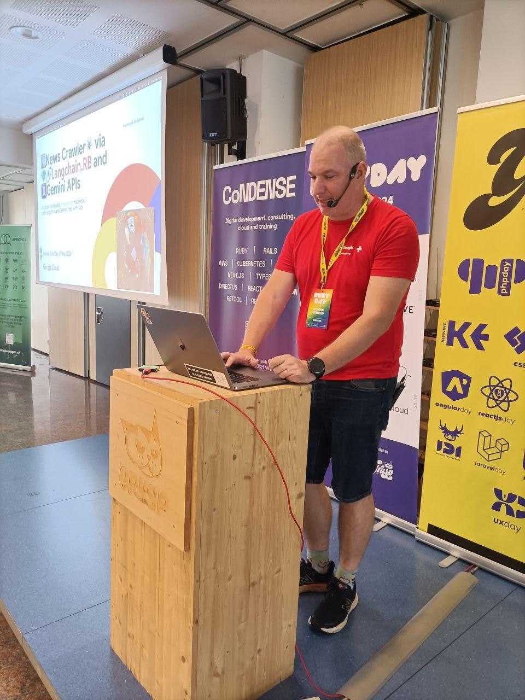
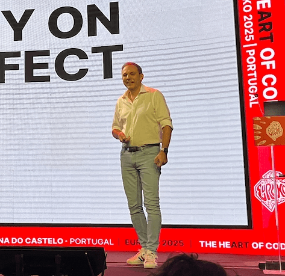

---

## Step 1: Scarica e Installa Google Antigravity 2.0 ⬇️

<a href="https://antigravity.google/download" target="_blank" rel="noopener noreferrer" style="display: inline-block; background-color: #1a73e8; color: white; padding: 6px 18px; border-radius: 6px; text-decoration: none; font-weight: bold; font-size: 0.85em;">
🚀 Scarica Antigravity 2.0
</a>
🔗 <a href="https://antigravity.google/download" target="_blank" rel="noopener noreferrer" style="color: #1a73e8; text-decoration: none;">antigravity.google/download</a>

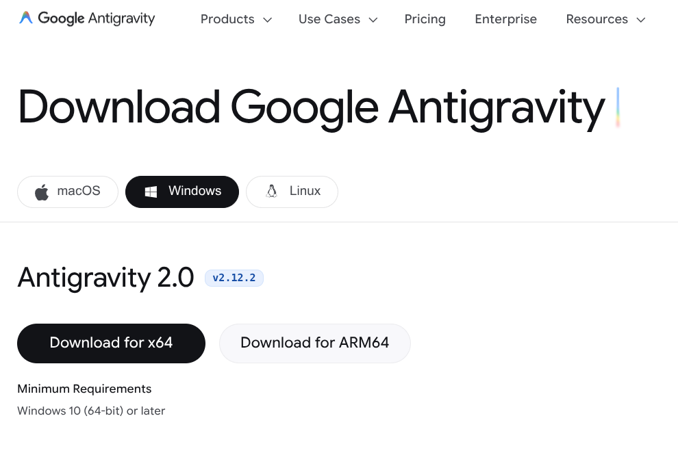

🪟 <strong>Nota per chi ha Windows:</strong> Usate <strong>WSL (Windows Subsystem for Linux)</strong> — è molto più facile per gestire Ruby, Docker e i comandi Linux!

---

## Step 1.5: Nel frattempo, Apri il Codelab Ufficiale (Pagina 1 &rarr; `#0`) 📖

<a href="https://codelabs.developers.google.com/codelabs/rails8-on-google-cloud?hl=it#0" target="_blank" rel="noopener noreferrer" style="display: inline-block; background-color: #1a73e8; color: white; padding: 7px 16px; border-radius: 6px; text-decoration: none; font-weight: bold; font-size: 0.82em;">
📖 Apri il Codelab Ufficiale (#0)
</a>

<ul style="font-size: 0.74em; margin: 0; padding-left: 18px;">
<li>⏳ <strong>Mentre Antigravity scarica:</strong> aprite il Codelab in <strong>Google Chrome</strong>!</li>
<li>🔢 <strong>Pagina 1 (<code>#0</code>):</strong> Introduzione &amp; Panoramica Architetturale.</li>
<li>💳 <strong>Pagina 2 (<code>#1</code>):</strong> Prerequisiti &amp; <strong>Crediti GCP Gratuiti</strong> (ci andremo allo Step 6!).</li>
</ul>

📱 <strong>Scansiona il QR per il Codelab</strong> <a href="https://codelabs.developers.google.com/codelabs/rails8-on-google-cloud?hl=it#0" target="_blank" rel="noopener noreferrer" style="color: #1a73e8;">codelabs.../rails8-on-google-cloud#0</a>

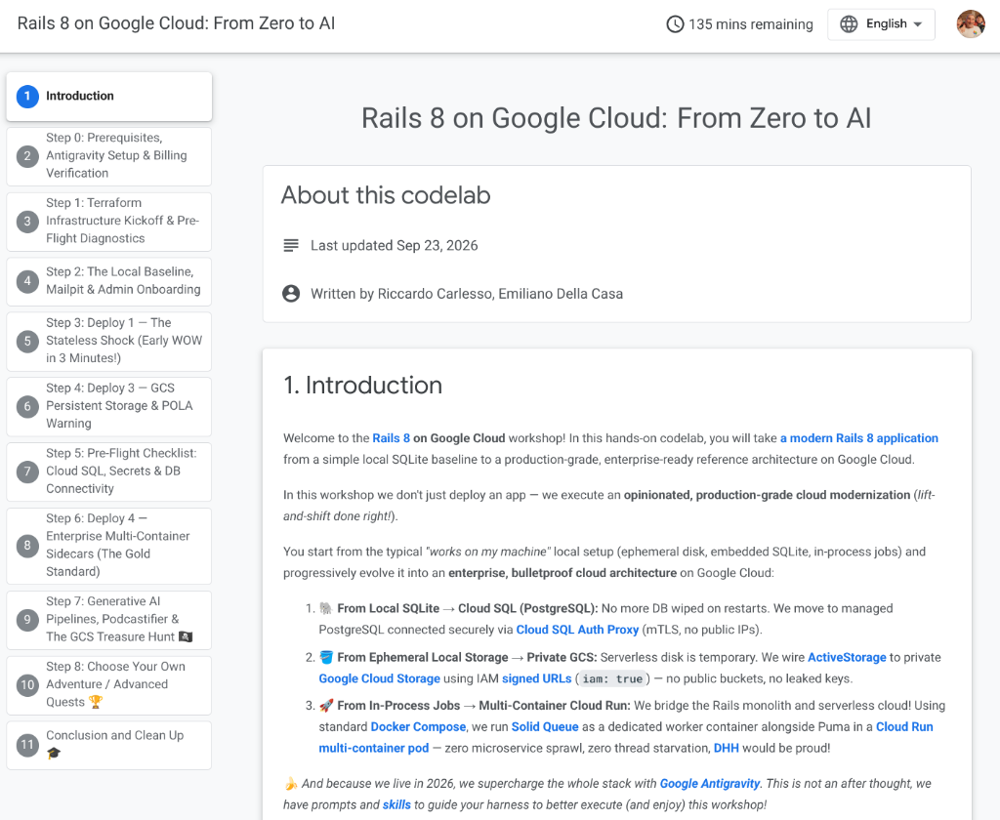

---

## Step 2: Fai Login con il tuo Account Gmail 🔐

1. Apri **Google Antigravity 2.0** &nbsp;&middot;&nbsp; 2. Clicca **Sign in with Google** &nbsp;&middot;&nbsp; 3. Autorizza l'agente.

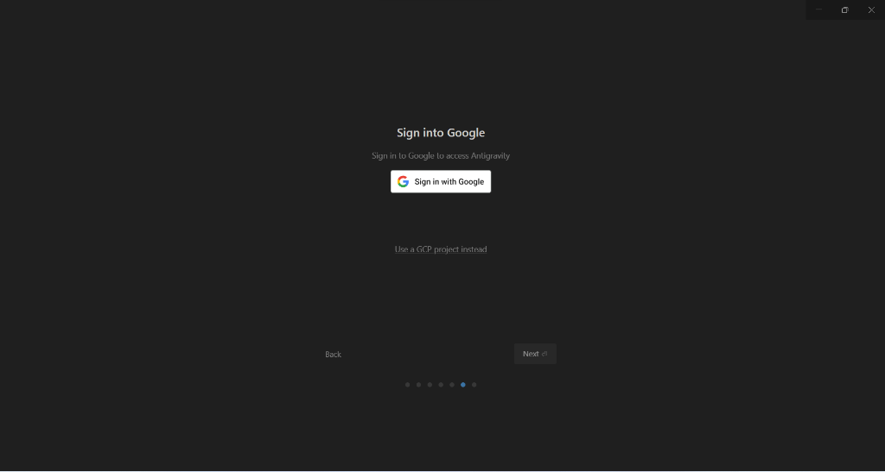

💡 Effettua il login con il tuo account <code>@gmail.com</code> personale (lo stesso che userai per riscattare i crediti GCP).

---

## Step 3: Prompt 1 — Scarica il Repo in `Documents` 📥

Incolla questo **primo prompt** nella chat di Antigravity per clonare il repository in `Documenti` / `Documents`:

Scaricami https://github.com/palladius/rails8-app-on-gcp/ (via git clone) dentro la cartella Documenti / Documents e suona un piccolo suono quando hai finito.

<button class="btn-copy" onclick="navigator.clipboard.writeText('Scaricami https://github.com/palladius/rails8-app-on-gcp/ (via git clone) dentro la cartella Documenti / Documents e suona un piccolo suono quando hai finito.'); this.innerText='✅ Copiato!'; setTimeout(() => this.innerText='📋 Copia Prompt 1 (Git Clone)', 2000)">📋 Copia Prompt 1 (Git Clone)</button>

🤖 <strong>Perché farlo via prompt?</strong> Antigravity verifica che <code>git</code> sia installato, clona <code>rails8-app-on-gcp</code> dentro <code>~/Documents/rails8-app-on-gcp</code> e riproduce un suono appena ha finito!

---

## Step 4a (Step 1.5): Crea un Nuovo Progetto nella Cartella Clonata 📁

Appena finisce il clone, apri un **nuovo progetto DENTRO** quella cartella:

<strong>1️⃣ Clicca <code>New Project</code> (Select a folder)</strong> Nella barra di sinistra <strong>Projects</strong>, clicca l'icona cartella+ e scegli <strong>New Project</strong>.

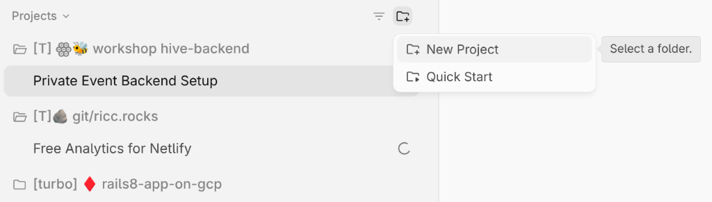

<strong>2️⃣ Seleziona <code>Documents/rails8-app-on-gcp</code></strong> Vai in <strong>Home / Documents</strong> e seleziona la cartella appena clonata <code>rails8-app-on-gcp</code>.

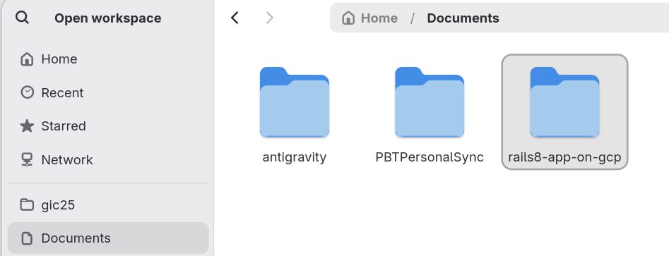

---

## Step 4b (Step 1.5): Scrivi `"ciao"` e Attiva la TURBO Mode ⚡

<strong>3️⃣ Scrivi <code>"ciao"</code> per far apparire il progetto a sinistra</strong> Invia <code>ciao</code> in chat per attivare la conversazione nella barra a sinistra, poi clicca <code>⋮</code> &rarr; <strong>Project Settings</strong>.

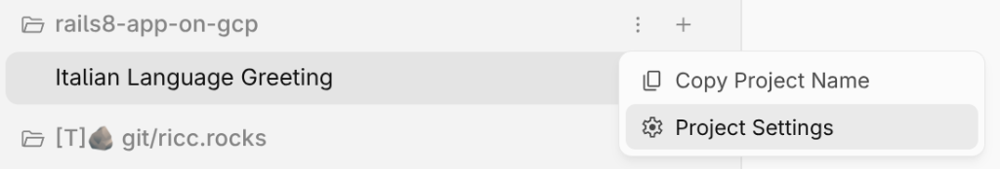

<strong>4️⃣ Imposta Security Preset su <code>Turbo mode</code></strong> Sotto <strong>Agent Settings &rarr; Security Preset</strong>, seleziona <strong>Turbo mode</strong> così non fa domande a ogni comando!

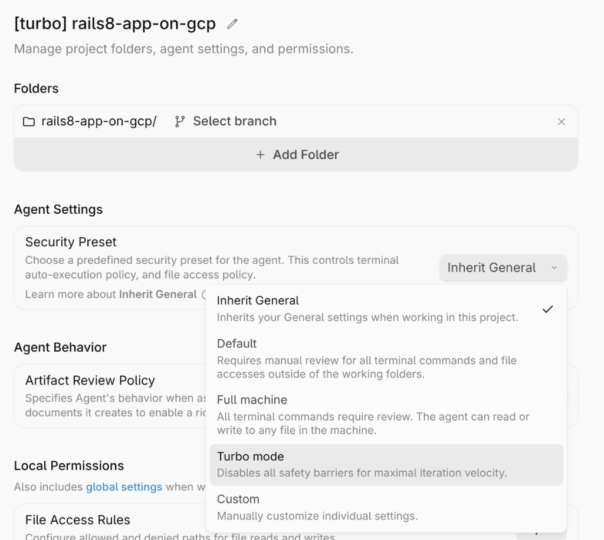

🚨 <strong>DISCLAIMER TURBO MODE:</strong> Attivate questa modalità SOLO su codice che può essere <strong>modificato e gestito al 100% da un agente</strong> in un workshop, codelab o ambiente di test! <strong>Non delegate mai il vostro giudizio a un agente — NON FATELO MAI IN PROD!</strong>

---

## Step 5: Prompt 2 — Il Prompt del Workshop Vero e Proprio 🎯

Dentro il progetto **`[turbo] rails8-app-on-gcp`**, incolla il **Prompt del Workshop**:

Sto partecipando al workshop su Rails 8 su Google Cloud. Segui il Codelab ufficiale di Google all'indirizzo https://codelabs.developers.google.com/codelabs/rails8-on-google-cloud#0 e guidami passo dopo passo! Leggiti le istruzioni per agente qui: https://github.com/palladius/rails8-app-on-gcp/blob/main/workshop/landing-page/README.it.md

<button class="btn-copy" onclick="navigator.clipboard.writeText('Sto partecipando al workshop su Rails 8 su Google Cloud. Segui il Codelab ufficiale di Google all\'indirizzo https://codelabs.developers.google.com/codelabs/rails8-on-google-cloud#0 e guidami passo dopo passo! Leggiti le istruzioni per agente qui: https://github.com/palladius/rails8-app-on-gcp/blob/main/workshop/landing-page/README.it.md'); this.innerText='✅ Copiato!'; setTimeout(() => this.innerText='📋 Copia Prompt 2 (Avvia Workshop)', 2000)">📋 Copia Prompt 2 (Avvia Workshop)</button>

📖 Antigravity leggerà <code>workshop/landing-page/README.it.md</code>, caricherà le skill del repository e lancerà <code>just workshop-test</code>!

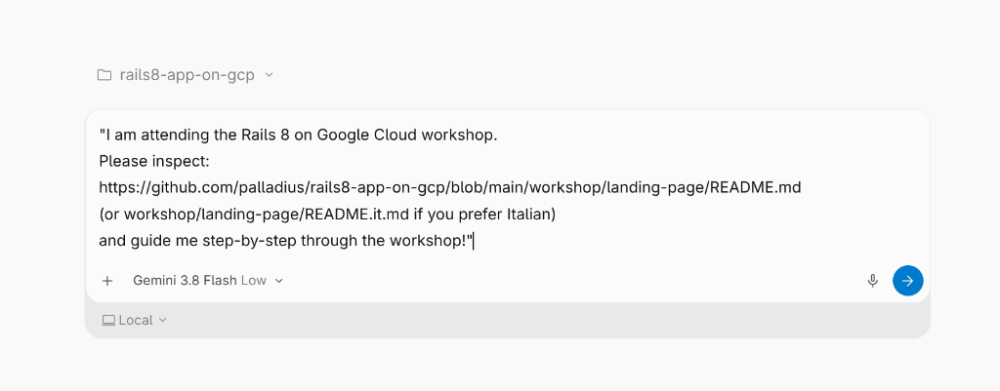

---

## Step 6 (Step 2.5): Reclama i Crediti GCP a Pagina 2 del Codelab 💳

Vai a <strong>Pagina 2</strong> del Codelab ufficiale per reclamare i crediti gratuiti Google Cloud:

<a href="https://codelabs.developers.google.com/codelabs/rails8-on-google-cloud#1" target="_blank" rel="noopener noreferrer" title="English Codelab (#1)" style="position: absolute; top: 12px; right: 16px; font-size: 0.7em; text-decoration: none; opacity: 0.82;">🇬🇧</a>

<a href="https://codelabs.developers.google.com/codelabs/rails8-on-google-cloud?hl=it#1" target="_blank" rel="noopener noreferrer" style="display: inline-block; background-color: #1e8e3e; color: white; padding: 7px 16px; border-radius: 6px; text-decoration: none; font-weight: bold; font-size: 0.82em;">
🎟️ Apri Codelab Pagina 2 (Crediti IT)
</a>

<ul style="font-size: 0.8em; margin: 0;">
<li>🌐 Aprite con <strong>Google Chrome</strong> e assicuratevi di essere loggati con il vostro <code>@gmail.com</code>.</li>
<li>🟢 <strong>Mi confermate che vedete un bottone VERDE?</strong> Commentate / diteci se sì o no!</li>
<li>⚠️ I primi step girano al 100% su <code>localhost</code> mentre il billing si attiva.</li>
</ul>

📱 Scansiona per aprire il Codelab

<strong>⚡ Finiti i crediti gratuiti di Antigravity?</strong> Cambia modello sotto il box del prompt scegliendo <strong>Claude / GPT-OSS</strong> oppure un modello <strong>Gemini Flash</strong>.

---

## Step 7: Prompt 3 — Crea il Progetto GCP (Dopo il Coupon) ☁️

Dopo che avete reclamato il coupon GCP a Pagina 2, incollate il **Prompt 3** in Antigravity:

Ho reclamato un coupon di GCP. Crea un progetto sotto la mia gmail, chiamalo con un nome tipo "workshop-modena-YYYYMMDD" e aggiungici altri caratteri random se non bastasse.

<button class="btn-copy" onclick="navigator.clipboard.writeText('Ho reclamato un coupon di GCP. Crea un progetto sotto la mia gmail, chiamalo con un nome tipo &quot;workshop-modena-YYYYMMDD&quot; e aggiungici altri caratteri random se non bastasse.'); this.innerText='✅ Copiato!'; setTimeout(() => this.innerText='📋 Copia Prompt 3 (Crea Progetto GCP)', 2000)">📋 Copia Prompt 3 (Crea Progetto GCP)</button>

🚀 <strong>Cosa succede ora:</strong> Antigravity crea il progetto (es. <code>workshop-modena-20261007-x9a2</code>), collega il billing account del coupon, aggiorna il file <code>.env</code> e verifica tutto con <code>just workshop-test</code>!

---

## Architettura Canonica di Riferimento 🏛️

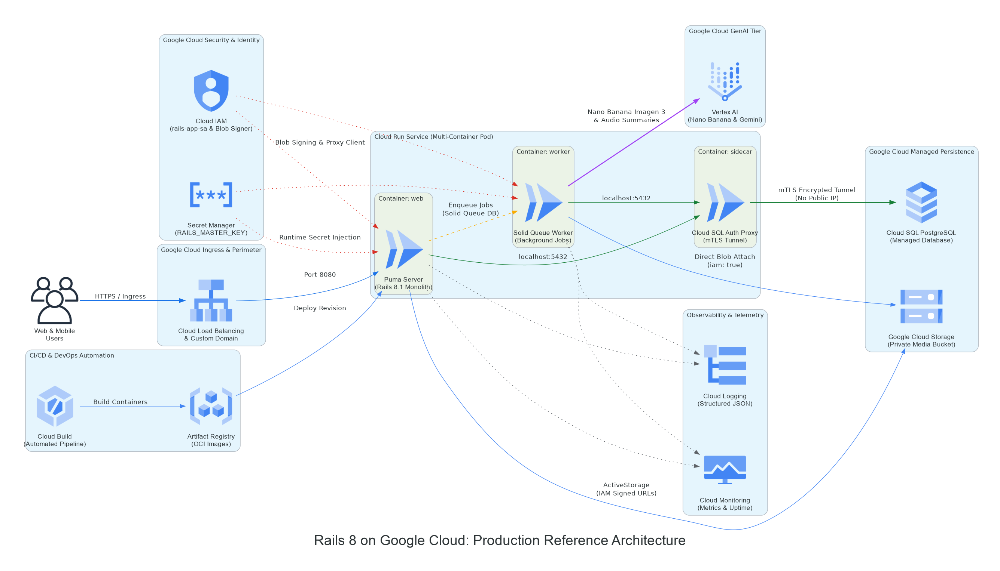

☁️ <strong>Full Production Reference Architecture:</strong> Cloud Run multi-container pod &middot; Cloud SQL PostgreSQL &middot; Private GCS &middot; Secret Manager &middot; Vertex AI

---

# Grazie! 🎉
### Costruiamo insieme con Google Antigravity 2.0 & Rails 8 🚀

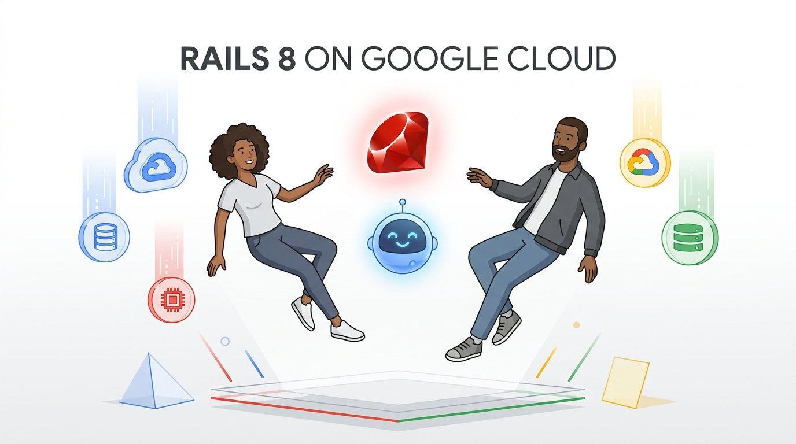

🦖 <strong>Riccardo:</strong> <a href="https://linkedin.com/in/riccardocarlesso" target="_blank" rel="noopener noreferrer">linkedin.com/in/riccardocarlesso</a>

🏎️ <strong>Emiliano:</strong> <a href="https://www.linkedin.com/in/emilianodellacasa" target="_blank" rel="noopener noreferrer">linkedin.com/in/emilianodellacasa</a>

👉 Codelab Ufficiale: <a href="https://codelabs.developers.google.com/codelabs/rails8-on-google-cloud?hl=it#0" target="_blank" rel="noopener noreferrer"><code>codelabs.developers.google.com/codelabs/rails8-on-google-cloud?hl=it</code></a>

🎵 Workshop Anthem
Lyria 3 Pro &middot; Vertex AI

<audio controls preload="none" style="width: 100%; height: 26px; margin: 2px 0;">
<source src="https://raw.githubusercontent.com/palladius/rails8-app-on-gcp/artifacts/issue-44/assets/lyria-3-pro-preview.mp3" type="audio/mpeg">
Your browser does not support audio playback.
</audio>

⚡ <a href="https://raw.githubusercontent.com/palladius/rails8-app-on-gcp/artifacts/issue-44/assets/lyria-3-clip-preview.mp3" target="_blank" rel="noopener noreferrer">Clip 30s</a>
🎸 <a href="https://raw.githubusercontent.com/palladius/rails8-app-on-gcp/artifacts/issue-44/assets/lyria-3-pro-preview.mp3" target="_blank" rel="noopener noreferrer">Canzone Intera 3m (3.4MB)</a>

