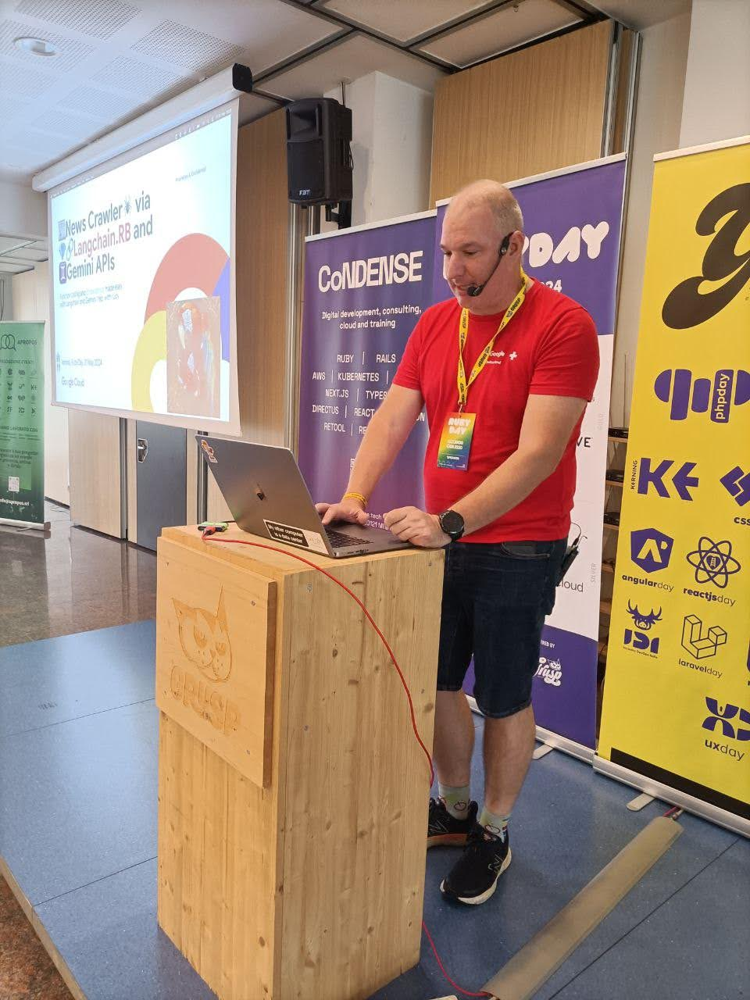
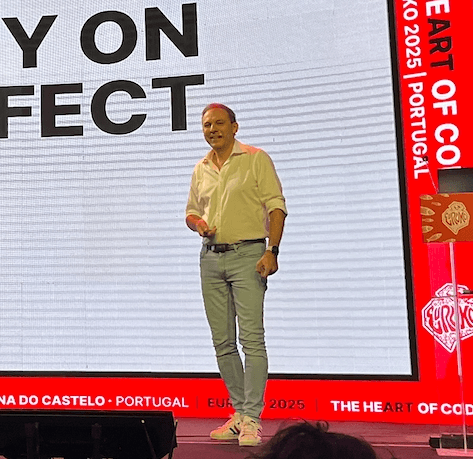
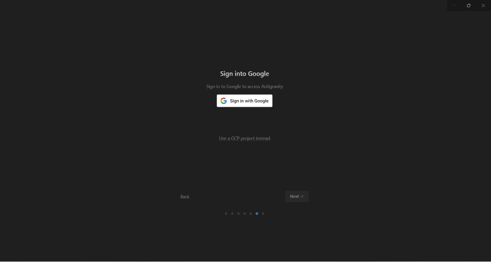
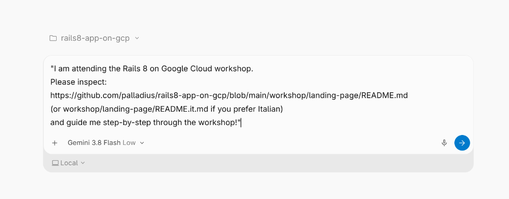

# Rails 8 on Google Cloud 🚀
### Workshop Kickoff & Pair Programming with Google Antigravity

  
  📱 Slides Link

  

  <strong>Riccardo Carlesso</strong> 🦖 &amp; <strong>Emiliano</strong> 🍝🏎️ &nbsp;&middot;&nbsp; <em>Google Cloud &amp; Open Source</em>

  
  

---

## 1. Download Google Antigravity 2.0 ⬇️

  <a href="https://antigravity.google/download" style="display: inline-block; background-color: #1a73e8; color: white; padding: 6px 18px; border-radius: 6px; text-decoration: none; font-weight: bold; font-size: 0.85em;">
    🚀 Download Antigravity 2.0
  </a>

  
  

    🔗 <a href="https://antigravity.google/download" style="color: #1a73e8; text-decoration: none;">antigravity.google/download</a>
  

  💡 <strong>Note:</strong> Not CLI, not IDE — <strong>Antigravity 2.0</strong> is all you need!

---

## 2. Launch & Connect Your Account 🔐

1. Open **Google Antigravity** &nbsp;&middot;&nbsp; 2. Click **Sign in with Google** &nbsp;&middot;&nbsp; 3. Authorize agent.

  

  💡 Sign in with your personal <code>@gmail.com</code> or workshop Google identity.

---

## 3. Reclaim Credits Now 💳

  

    
Redeem your Google Cloud credits for today's workshop:

    

      <a href="https://me.developers.google.com/benefits/claim/test-workshop-rails8" style="display: inline-block; background-color: #1a73e8; color: white; padding: 8px 16px; border-radius: 6px; text-decoration: none; font-weight: bold; font-size: 0.85em;">
        🎟️ Claim GCP Credits
      </a>
    

    <ul style="font-size: 0.85em;">
      <li>🔗 <strong>Link:</strong> <a href="https://me.developers.google.com/benefits/claim/test-workshop-rails8">me.developers.google.com/...</a></li>
      <li>☁️ Activate sandbox GCP Project & billing.</li>
      <li>💵 Covers Cloud Run, Cloud SQL & GCS.</li>
    </ul>
  

  

    
    
📱 Scan with phone camera

  

⚠️ **Localhost First!** Initial steps run 100% locally on SQLite/Docker before touching the cloud.

---

## 4. Launch Antigravity & Set The Mission 🎯

1. **Open Antigravity** on your computer.
2. **Choose the path to your repo** (if you have already cloned it). If you didn't, don't worry, Antigravity will guide you through it!
3. Send this mission prompt to start your pair-programming journey:

"I am attending the Rails 8 on Google Cloud workshop. 
Please inspect: 
https://github.com/palladius/rails8-app-on-gcp/blob/main/workshop/landing-page/README.md 
(or workshop/landing-page/README.it.md if you prefer Italian) 
and guide me step-by-step through the workshop!"

<button class="btn-copy" onclick="navigator.clipboard.writeText('I am attending the Rails 8 on Google Cloud workshop.\nPlease inspect:\nhttps://github.com/palladius/rails8-app-on-gcp/blob/main/workshop/landing-page/README.md\n(or workshop/landing-page/README.it.md if you prefer Italian)\nand guide me step-by-step through the workshop!'); this.innerText='✅ Copied!'; setTimeout(() => this.innerText='📋 Copy Prompt', 2000)">📋 Copy Prompt</button>

---

# Thank You! 🎉
### Let's Build Rails 8 on Google Cloud 🚀

  

    
    🦖 <strong>Riccardo:</strong> <a href="https://linkedin.com/in/riccardocarlesso">linkedin.com/in/riccardocarlesso</a>
  

  

    
    🏎️ <strong>Emiliano:</strong> <a href="https://www.linkedin.com/in/emilianodellacasa">linkedin.com/in/emilianodellacasa</a>
  

👉 Start hacking at <a href="https://github.com/palladius/rails8-app-on-gcp/blob/main/workshop/landing-page/README.md"><code>workshop/landing-page/README.md</code></a>

  🎵 Workshop Anthem
  Lyria 3 Pro &middot; Vertex AI

<audio controls preload="none" style="width: 100%; height: 26px; margin: 2px 0;">
<source src="https://raw.githubusercontent.com/palladius/rails8-app-on-gcp/artifacts/issue-44/assets/lyria-3-pro-preview.mp3" type="audio/mpeg">
Your browser does not support audio playback.
</audio>

⚡ <a href="https://raw.githubusercontent.com/palladius/rails8-app-on-gcp/artifacts/issue-44/assets/lyria-3-clip-preview.mp3">30s Clip</a>
🎸 <a href="https://raw.githubusercontent.com/palladius/rails8-app-on-gcp/artifacts/issue-44/assets/lyria-3-pro-preview.mp3">Full 3m Song (3.4MB)</a>

