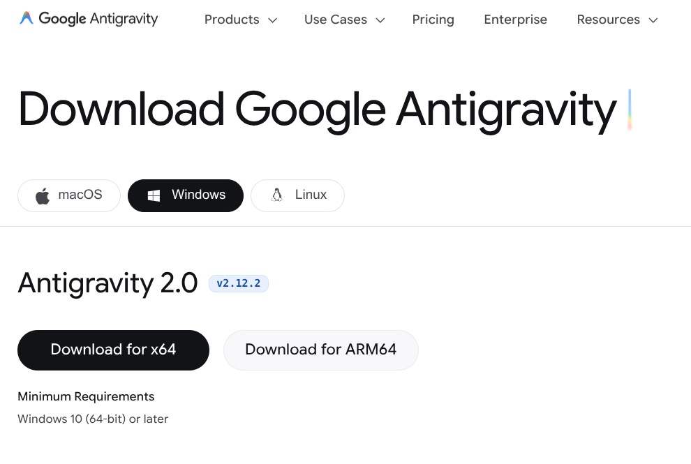
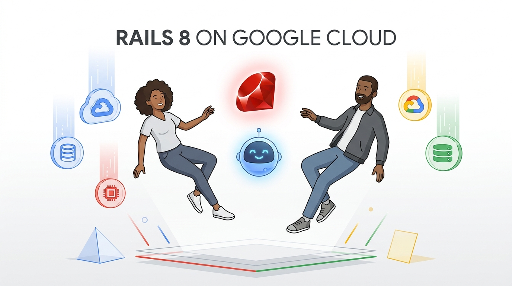

# Rails 8 on Google Cloud 🚀
### Workshop Kickoff & Pair Programming with Google Antigravity

<div style="text-align: center; margin: 10px 0;">
  
</div>

<p style="text-align: center; font-size: 0.8em; margin: 6px 0 0 0;">
  <strong>Riccardo Carlesso</strong> 🦖 &amp; <strong>Emiliano</strong> 🍝🏎️ &nbsp;&middot;&nbsp; <em>Google Cloud &amp; Open Source</em>
</p>

---

## 1. Download Google Antigravity 2.0 📥

<div style="margin: 8px 0 12px 0;">
  <a href="https://antigravity.google/download" style="display: inline-block; background-color: #1a73e8; color: white; padding: 6px 16px; border-radius: 6px; text-decoration: none; font-weight: bold; font-size: 0.85em;">
    🚀 Download Antigravity 2.0 (antigravity.google/download)
  </a>
</div>

<div style="text-align: center; margin: 4px 0;">
  
</div>

<p style="font-size: 0.8em; color: #5f6368; text-align: center; margin: 6px 0 0 0;">
  💡 <strong>Note:</strong> Not CLI, not IDE — <strong>Antigravity 2.0</strong> is all you need!
</p>

---

## 2. Launch & Connect Your Account 🔐

1. Open **Google Antigravity** on your laptop.
2. Sign in with your **Google Account** (`@gmail.com` or corporate Google identity).
3. Authorize the pair programmer agent.

```
┌────────────────────────────────────────────────────────┐
│  🚀 Welcome to Google Antigravity                      │
│                                                        │
│  [ G  Sign in with Google ]                            │
│                                                        │
│  Connected: you@domain.com  🟢 Ready                   │
└────────────────────────────────────────────────────────┘
```

---

## 3. [Optional] Reclaim Cloud Credits 💳

If this is a live in-person or virtual workshop, redeem your Google Cloud credits:

- 🎟️ **Scan the Workshop QR Code** or follow the event voucher link.
- ☁️ Activate your sandbox GCP Project.
- 💵 Ensure your active billing/voucher covers Cloud Run, Cloud SQL, and Cloud Storage.

<div class="highlight">

⚠️ **Localhost First!** Initial workshop steps run 100% locally on SQLite and Docker Compose before touching the cloud.

</div>

---

## 4. Launch Antigravity & Set The Mission 🎯

Open Antigravity and paste the following prompt in the chat:

<div class="prompt-box">
"I am attending the Rails 8 on Google Cloud workshop.<br/>
Please inspect:<br/>
https://github.com/palladius/rails8-app-on-gcp/blob/main/workshop/landing-page/README.md<br/>
(or workshop/landing-page/README.it.md if you prefer Italian)<br/>
and guide me step-by-step through the workshop!"
</div>

---

# Thank You! 🎉
### Let's Build Rails 8 on Google Cloud 🚀

<div style="text-align: center; margin: 8px 0;">
  
</div>

<p style="text-align: center; font-size: 0.8em; margin: 4px 0;">
  🦖 <strong>Riccardo Carlesso:</strong> <a href="https://linkedin.com/in/riccardocarlesso">linkedin.com/in/riccardocarlesso</a> &nbsp;&middot;&nbsp; 
  🏎️ <strong>Emiliano Della Casa:</strong> <a href="https://www.linkedin.com/in/emilianodellacasa">linkedin.com/in/emilianodellacasa</a>
</p>

<p style="text-align: center; font-size: 0.8em; margin: 4px 0 0 0;">
  👉 Head over to <a href="https://github.com/palladius/rails8-app-on-gcp/blob/main/workshop/landing-page/README.md"><code>workshop/landing-page/README.md</code></a> to start hacking!
</p>

