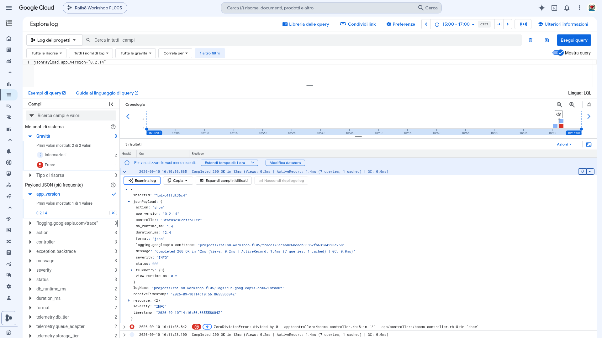

# Why is this workshop different? 🚀

### Deploying Modern Rails 8 on Google Cloud (From Zero to AI)

**Riccardo Carlesso & Emiliano Mancuso** (with AI Partner **Antigravity**)

---

## Native Structured JSON Logging in Google Cloud 🪵

