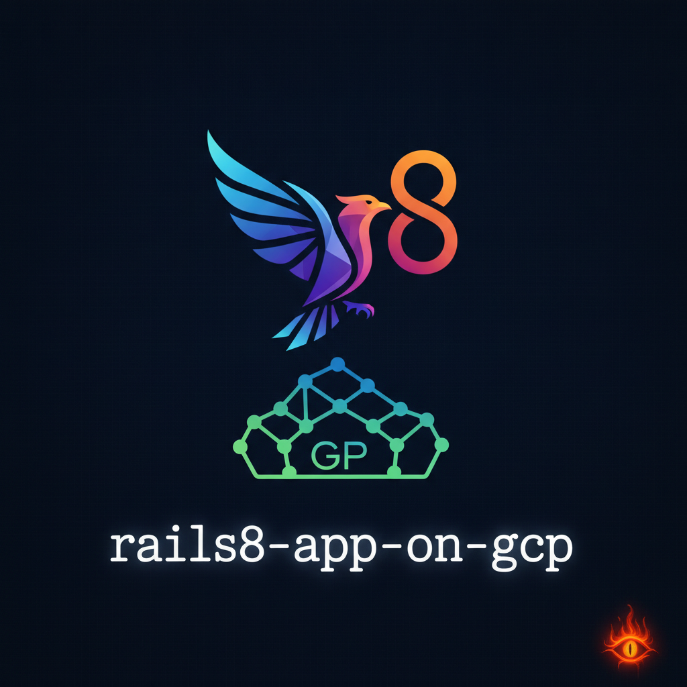
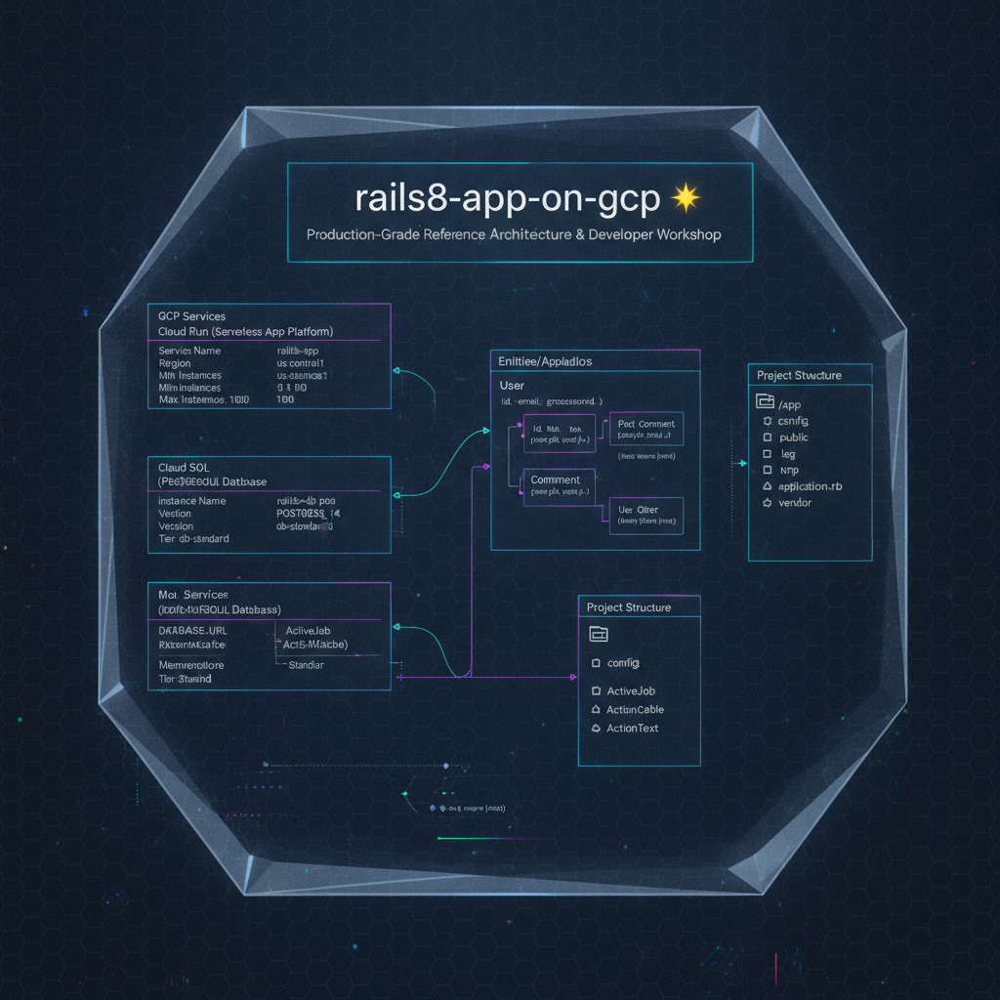

  

# 🌟 Project Summary: `rails8-app-on-gcp`

## 📌 Overview
**`rails8-app-on-gcp`** is a production-grade reference architecture and hands-on developer workshop designed to showcase modern **Ruby on Rails 8** running seamlessly on **Google Cloud Platform (GCP)**. Maintained by Riccardo, Emiliano, and AI agents (Antigravity/Gemini/Claude Code), the project bridges the gap between Rails conventions and cloud-native Google Cloud infrastructure.

---

## 🎯 Dual North Stars & Purpose

1. **The Canonical Rails 8 on GCP Blueprint (`main`)**:
   - A fully assembled, production-ready enterprise reference architecture.
   - Features **Google Cloud Run** multi-container sidecars (`web` + `worker` Solid Queue + `cloudsql-proxy`), **Cloud SQL (PostgreSQL)**, **ActiveStorage on Google Cloud Storage (GCS)** with IAM Credential blob signing, Secret Manager, Cloud Build CI/CD, and GenAI jobs (Gemini / Imagen).

2. **The Universal Developer Workshop (`workshop/`)**:
   - A step-by-step hands-on curriculum (with branches following `workshop/step-<N>-<slug>`).
   - Designed for all developers (including ~90% with zero Ruby background), demystifying serverless GCP architecture, security anti-patterns (e.g., eliminating `0.0.0.0/0` exposure and public buckets), and AI-assisted pair programming using **Google Antigravity**.

---

## 🏗️ Repository Architecture & Key Directories

- **`blog/`**: The core Ruby on Rails 8.1 application (Ruby 3.4, Hotwire Turbo/Stimulus, Tailwind CSS watcher, ActionText, Solid Queue/Cache/Cable, and custom error handling).
- **`workshop/`**: Educational curriculum, codelab markdown documents (`CODELAB.md`, `UNTOUCHABLE-CONSTITUTION.md`, `SKELETON.md`), a Sinatra-based visualizer server, and build tools compiled to GitHub Pages.
- **`iac/`**: Infrastructure as Code (IaC) using Terraform with Google Cloud Fabric FAST, Cloud Build definitions, and deployment scripts.
- **`conductor/`**: Conductor methodology configuration for AI-assisted workflow tracking, product guides, specifications, and active work tracks.
- **`docs/`**: Supreme governance docs (e.g., `CONSTITUTION.md`), Customer User Journeys (CUJs), user manuals, and friction logs.

---

## 🚀 Local Development & Runtime Modes

The repository implements strict localhost invariants (the app must run offline without GCP credentials) and fail-fast telemetry badges:

| Mode | Command | Port(s) | Description |
| :--- | :--- | :--- | :--- |
| 🚀 **Native Rails** | `just dev` | `:3000` | Native Rails development via SQLite & Tailwind watcher |
| 🐳 **Docker Compose** | `just compose-up` | `:3000`, `:5432`, `:8025`, `:8081` | Full containerized stack with Postgres, Solid Queue worker, Mailpit email catcher, and Adminer DB admin |
| 📖 **Workshop UI** | `just workshop-dev` | `:8080` | Interactive Sinatra Codelab server with document switcher |

---

## 📜 Key Directives & Governance Files

- **`docs/CONSTITUTION.md`**: The supreme, immutable meta-constitution ratified across human and AI maintainers (requires a 2/3 supermajority to modify).
- **`AGENTS.md` (symlinked as `GEMINI.md`)**: Canonical operational rules for coding assistants (Gemini, Claude, Antigravity). Enforces English-first resources, deterministic branch names (`workshop/step-<N>-<slug>`), and sub-5-second diagnostic test suites.
- **`CHANGELOG.md`**: Semantic version tracking (currently at `v0.1.24`).
- **`TODOs.md`**: Forward-looking backlog covering cloud logging/monitoring, Day-1 Mailpit onboarding, and advanced workshop quests (such as Cloud IAP and `pgvector` semantic search).

---

## 🗺️ Architecture & Code Structure Visuals

| Architecture Diagram | Code Structure & E/R Diagram |
| :---: | :---: |
|  |  |
